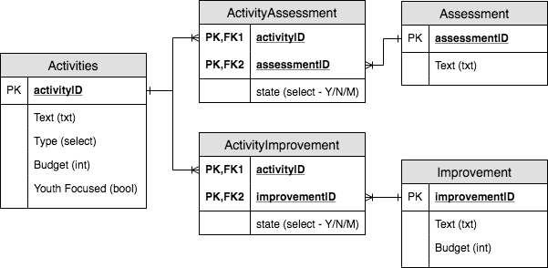

# Get Started / Installation
1) Install [yarn](https://yarnpkg.com/lang/en/)
2) In the root of this directory run `yarn install` to install dependencies

# To Develop Locally
1) Run `yarn serve` in the root dir to run a server on localhost
2) Go to `localhost:8080` to view the app

# Package for distribution on your own server
1) Install the application
2) Package the app for hosting use run `yarn build` (the final files will be in the `/dist` folder)
- [Vue CLI documentation for deployment](https://cli.vuejs.org/guide/deployment.html#general-guidelines)
- [Article on deployment with NGINX as webserver on Digital Ocean](https://medium.com/@Web_Bailey/deploy-a-vuejs-app-with-digitalocean-fd6e7af07e40)

# Creating and distributing the desktop builds
After having gone through the get started steps:
1) Package the app for desktop use run `yarn build:electron --windows` or `yarn build:electron --macos` (the final files will be in the `/dist_electron` folder)
2) Zip the `.dmg` file for mac and name the file `mac-installer.zip`
3) Zip the `.exe` file for windows and name the file `windows-installer-portable.zip`
4) Zip the folder named `win-ia32-unpacked` and name the file `windows-installer.zip`
5) Clone the LFS respository `git lfs clone git@github.com:E2A/e2a-electron-builds.git`
6) Copy the files you just zipped from steps 2-4, and replace the cloned files in the repository found in step 5
7) If you prefer web-based uploading, go to the [git repository](https://github.com/E2A/e2a-electron-builds) and upload the files there.
8) If there were major changes in the file sizes, update the MBs listed in the current site content [here](https://github.com/E2A/e2a-cip/blob/master/src/locales/en.yaml)

# Editing Content
To edit content you can click [here](https://github.com/E2A/e2a-cip/blob/master/src/locales/en.yaml)

It uses Markdown - you can test your text [here](http://miaolz123.github.io/vue-markdown/)

To add resources and other files you can upload them to `public/uploads` you can access it [here](https://github.com/E2A/e2a-cip/tree/master/public/uploads)

# Data Structure / ERD
We are using [Vuex ORM](https://vuex-orm.github.io/vuex-orm/) for data management.

Edit ERD by going to [draw.io](https://draw.io) and upload the [E2A_ERD.xml](/docs/E2A_ERD.xml) file.

### ERD Diagram for Application

